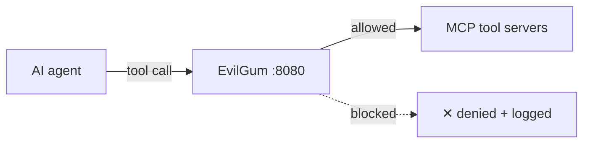

<div align="center">

# EvilGum — Security Gateway for MCP

**A drop-in L7 firewall between your AI agents and MCP tool servers.**
It adds the identity, authorization, information-flow control, and DLP that the Model Context Protocol leaves out — enforcing safety at the *action* layer, so a hijacked agent still can't cause harm.

[]() []() []() []()

</div>

---

## The problem

MCP lets an AI agent use real tools — read files, send email, query databases, run commands. But the protocol ships with **no identity, no access control, no data-loss protection, and no defense against tool poisoning or prompt injection.** A single poisoned tool description or a hijacked agent can read a secret and exfiltrate it, or run a destructive command.

## What EvilGum does

You put it on the wire. Nothing else about your agent changes.



Every tool call passes through the gateway first, which checks: *is this identity real? is this agent allowed this tool? is a tainted session trying to exfiltrate? is this an injection or a rug-pull?* — then forwards it or blocks it.

## Controls

| Control | What it does |
|---|---|
| **Identity** | Asymmetric JWT (RS256/ES256), enforced `exp`/`aud`/`iss`, OAuth 2.1-ready; refuses to start on weak config |
| **Authorization** | Per-tool RBAC, scope-based admin, cryptographic capability tokens (macaroons) that only attenuate |
| **Information-flow control** | Capability taint blocks read-then-exfiltrate chains; optional value-level tracking of source data into sinks |
| **Rug-pull prevention** | Schema-lock detects tool drift and description poisoning mid-session |
| **DLP & WAF** | PII redaction on tool responses; injection / SSRF / traversal / log4j signatures with a recursive decoder |
| **Transport & resilience** | Verified mTLS, secrets from env/KMS, **fail-closed** on backend outage |
| **Observability** | Hash-chained **tamper-evident audit log**, Prometheus metrics, real-time exfil/rug-pull alerts |

## Benchmarks

Run them yourself — everything below is reproducible from this repo.

- **0% agent-hijack ASR** — NVIDIA **garak** fired ~15,000 injection/jailbreak attempts at a deliberately hijacked agent; the gateway blocked every harmful action (12/12 probes PASS).
- **100% attack corpus blocked** — 56 payloads across command injection, SQLi, path traversal, XSS, SSRF, template/log4j, encodings, auth/RBAC/protocol/IFC bypass, DoS.
- **0 crashes** across 3,000 fuzzed requests · **86% coverage** · **81 tests**.
- Mapped to **OWASP MCP Top 10**, **OWASP API Security Top 10**, and **OWASP Agentic Top 10**.

```bash
python bench.py                                   # security + fuzz + load + OWASP compliance
python -m pytest -q                               # 81 tests
bash benchmarks/attack_replay.sh                  # live attack replay
garak -m rest -G benchmarks/garak_mcp_rest.json -p latentinjection,promptinject
```

## Quickstart

```bash
git clone https://github.com/Iffi-crux/evilgum && cd evilgum
pip install -r requirements.txt

# dev run (in-memory Redis, stub upstream)
python -m uvicorn run_dev:app --port 8080

# production (real Redis + your IdP key + mTLS certs from env)
docker compose -f docker-compose.prod.yml up -d
```

Point your agent at `https://your-host/rpc` with a `Bearer` token. Grant tools with a `POST /admin/roles/<agent>` call (admin scope required). See [`REMEDIATION_V6.md`](REMEDIATION_V6.md) and [`benchmarks/`](benchmarks/) for detail.

## Open-core

EvilGum's engine is free and open (Apache-2.0). Hosted deployment, an admin dashboard, SSO connectors, multi-tenant control plane, and compliance reporting are offered as a commercial layer — [get in touch](https://faseel.app/evilgum) or email [info@faseel.app](mailto:info@faseel.app).

## Status

Pilot-ready and externally validated; **general-availability for regulated production still requires an external penetration test.** See [`SECURITY.md`](SECURITY.md).

## License

[Apache-2.0](LICENSE) © Faseel
